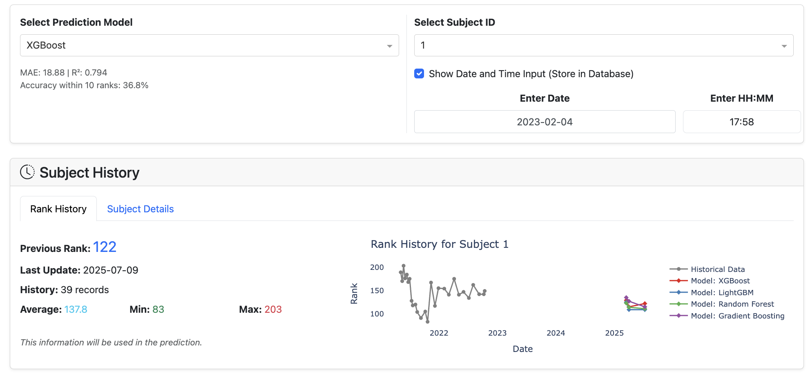

# RankLab: Ranking Dynamics in Multi-Criteria Decision Analysis

RankLab is a dynamic risk-ranking system that uses ensemble machine learning techniques to predict rankings based on multiple time-varying criteria. This tool helps stakeholders proactively manage supplier risks and optimize decision-making processes.



## Project Overview

RankLab addresses the need for nuanced Multi-Criteria Decision Analysis (MCDA) by refining and deploying a dynamic risk ranking system using an ensemble of machine learning techniques. The system analyzes patterns in rank fluctuations across performance criteria to predict future rankings. For additional project work and the [complete project plan](https://docs.google.com/spreadsheets/d/15JWSLvFADyQ4BJYCcOFMrr5NmEh6Ry9Sy5_v7HUJQiw/edit?usp=sharing), visit this [Google Drive](https://drive.google.com/drive/folders/16ztBnDYcFYFvIZCSEksDtsQ0AAZStirj?usp=sharing). A [screen recording](https://drive.google.com/file/d/1a8QUuOYbD_F4lETYktZ9tXeUtngpKZq9/view?usp=sharing) that demonstrates using the application can also be found on our Google Drive.

Key features:
- Multi-model tracking for concurrent visualization of prediction models
- Feature importance analysis for transparent interpretation
- Interactive dashboard for real-time rank forecasting
- Comprehensive data pipeline with AWS cloud architecture

## Repository Structure

```
capstone-boeing-2025/
├── .github/workflows/    # CI/CD configuration
├── app/                  # Dash web application
│   └── app.py            # Main Dash application
├── assets/               # Custom CSS and images for the app
├── data/                 # Data files and database modules
│   ├── Rank.csv          # Raw data file
│   ├── rankings.db       # SQLite database
│   ├── seed_db.py        # Python module for creating SQLite database
│   └── validate_db.py    # Python module for validating SQLite database
├── docs/                 # Documentation files
│   ├── Project Proposal.pdf
│   ├── Final Poster.pdf
│   ├── RankLab Cloud Architecture.pdf
│   └── user_guide.md     
├── models/               # Saved model files and model testing
│   ├── mcda_model_rank_prediction.ipynb
│   └── positional_models_notebook.ipynb
├── tests/                # Test files
│   ├── app_test.py       # Tests for the Dash app
│   └── seed_db_test.py   # Tests for the SQLite database
├── LICENSE               # MIT license
└── README.md             # This file
```

## Getting Started

### Prerequisites

- Python 3.8 or higher
- pip package manager

### Local Installation

The instructions below are for setting up and running RankLab locally. Note that this project has also been deployed to production using Docker, Gunicorn, and Amazon S3/EC2 cloud services.

1. Clone the repository:
```bash
git clone https://github.com/apeled/capstone-boeing-2025.git
cd capstone-boeing-2025
```

2. Install required packages:
```bash
pip install -r requirements.txt
```

### Replicating the Analysis

The core methodology and model development are contained in Jupyter notebooks:

1. Start with `models/mcda_model_rank_prediction.ipynb` for the fundamental methodology:
   - Baseline Mean Absolute Error (MAE) using median rank
   - Multivariate Ordinal Regression model (MORD) implementation
   - Tree-based ensemble methods (Random Forest, XGBoost, LightGBM, Gradient Boosting)

2. Explore `models/positional_models_notebook.ipynb` for additional features and improvements:
   - Feature engineering
   - Hyperparameter optimization
   - Model evaluation and comparison

### Running the Web Application

Once the models are trained and saved, you can run the Dash web application:

1. Navigate to the app directory:
```bash
cd app
```

2. Run the application:
```bash
python app.py
```

3. Open your web browser and go to `http://127.0.0.1:8050/` to access the dashboard.

## Using the RankLab Application

The RankLab dashboard allows you to:

1. **Select Prediction Model**: Choose between LightGBM, XGBoost, Gradient Boosting, and Random Forest models.

2. **Select Subject ID**: Choose a specific subject to analyze.

3. **View Subject History**: Examine historical ranking data with predictions from different models.

4. **Make Predictions**: Input factor values to generate rank predictions.

5. **Compare Models**: Visualize and compare the performance of different prediction models.

6. **Save Predictions**: Store your predictions in the SQLite database for future reference.

## Data Structure

The dataset consists of:
- 31,933 observations across 1,223 unique entities
- 17 ordinal decision-making factors
- Risk rankings from 1 (highest risk) to 265 (lowest risk)
- Observations collected at irregular intervals from May 2021 to October 2022

## Development and Testing

### Database Operations

The SQLite database (`data/rankings.db`) stores both historical data and new predictions. Python modules in `data/` handle seeding and validating the database.

### Testing

- App tests in `tests/app_test.py` verify the Dash application's functionality.
- Database tests in `tests/seed_db_test.py` ensure data integrity.
- Model testing is integrated into the `models/` directory.

## AWS Deployment

## Step 1: Launch an EC2 Instance

1. Sign in to the AWS Management Console
2. Navigate to the EC2 Dashboard
3. Click "Launch Instance"
4. Choose Ubuntu Server as the AMI
5. Select an instance type (t2.micro is free tier eligible)
6. Configure security group:
   - Allow SSH (port 22) from your IP
   - Allow Custom TCP on port 8050 from anywhere (0.0.0.0/0)
7. Launch the instance and download the key pair (.pem file)

## Step 2: Connect to Your EC2 Instance

For Mac/Linux:
```bash
chmod 400 your-key.pem
ssh -i your-key.pem ubuntu@your-instance-public-ip
```

For Windows (using PuTTY or Windows Terminal):
- Convert .pem to .ppk with PuTTYgen if using PuTTY
- Connect using the key and your instance's public IP

## Step 3: Set Up the Environment

```bash
# Update package lists
sudo apt-get update

# Install Python and development tools
sudo apt-get install -y python3-pip python3-dev build-essential git

# Clone your repository
git clone https://github.com/your-username/your-repository.git
cd your-repository

# Create and activate virtual environment
python3 -m venv venv
source venv/bin/activate

# Install required packages
pip install -r requirements.txt
```

## Step 4: Run the Application with Gunicorn

```bash
# Start the application with nohup to keep it running after you disconnect
nohup gunicorn -b 0.0.0.0:8050 app:server &

# To check if it's running
ps aux | grep gunicorn

# To view the application logs
cat nohup.out
```

## Step 5: Access the Application

Open your web browser and navigate to:
```
http://your-instance-public-ip:8050
```

## Troubleshooting

### If the application isn't accessible:
1. Check security group settings in AWS console
2. Verify the application is running: `ps aux | grep gunicorn`
3. Check application logs: `cat nohup.out`

### If you need to stop the application:
```bash
pkill gunicorn
# OR
kill -9 <PID>
```

### If you're out of disk space:
```bash
# Check disk usage
df -h

# Increase EBS volume size in AWS Console, then:
sudo growpart /dev/xvda 1
sudo resize2fs /dev/xvda1
```

### Missing Python modules:
```bash
# Ensure you're in your virtual environment
source venv/bin/activate

# Install any missing modules
pip install module_name
```

### To update your application:
```bash
# Pull latest changes
git pull

# Restart the application
pkill gunicorn
nohup gunicorn -b 0.0.0.0:8050 app:server &
```

## Note:
The deployment URL (http://your-instance-public-ip:8050) will be active until the EC2 instance is terminated. For the RankLab application, visit `http://3.90.69.124:8050/` to access the dashboard.

## License

This project is licensed under the MIT License - see the [LICENSE](LICENSE) file for details.

## Contributors

- Jake Flynn
- Amit Peled
- Mark Ralston Daniel
- Dr. Shuguang Song

## Acknowledgments

This project was developed as a Capstone project for the University of Washington Master of Science in Data Science program.
