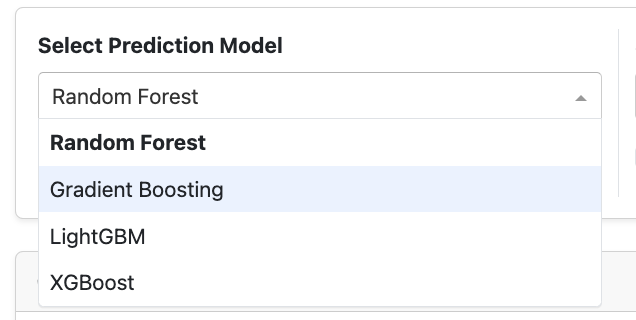
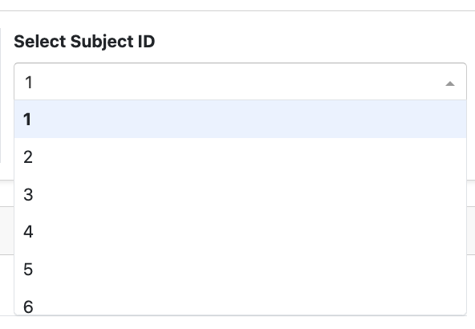
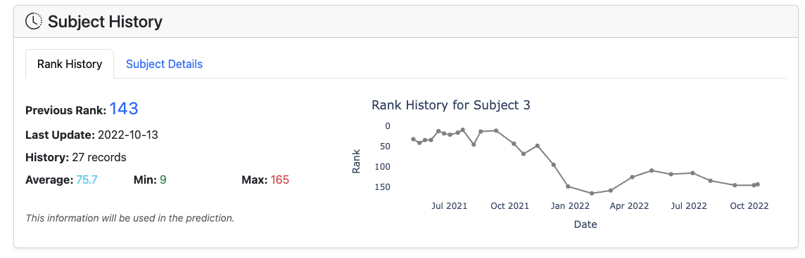
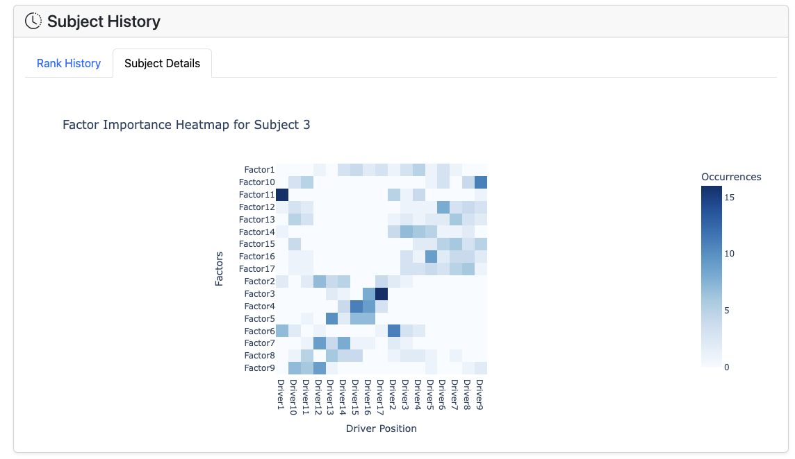
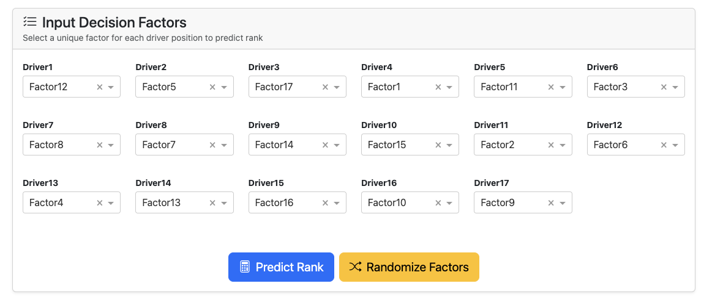
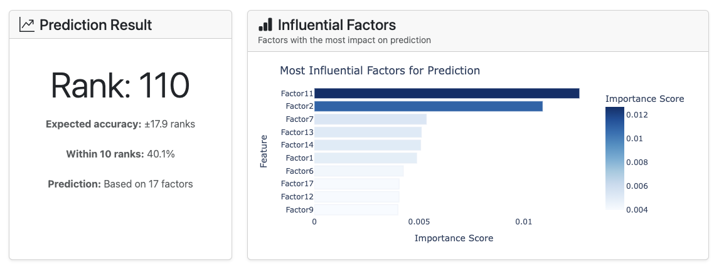
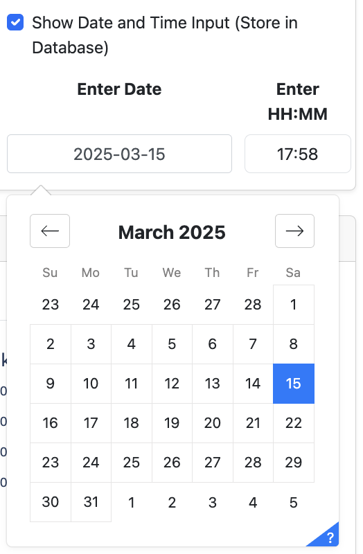
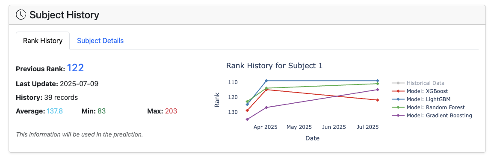
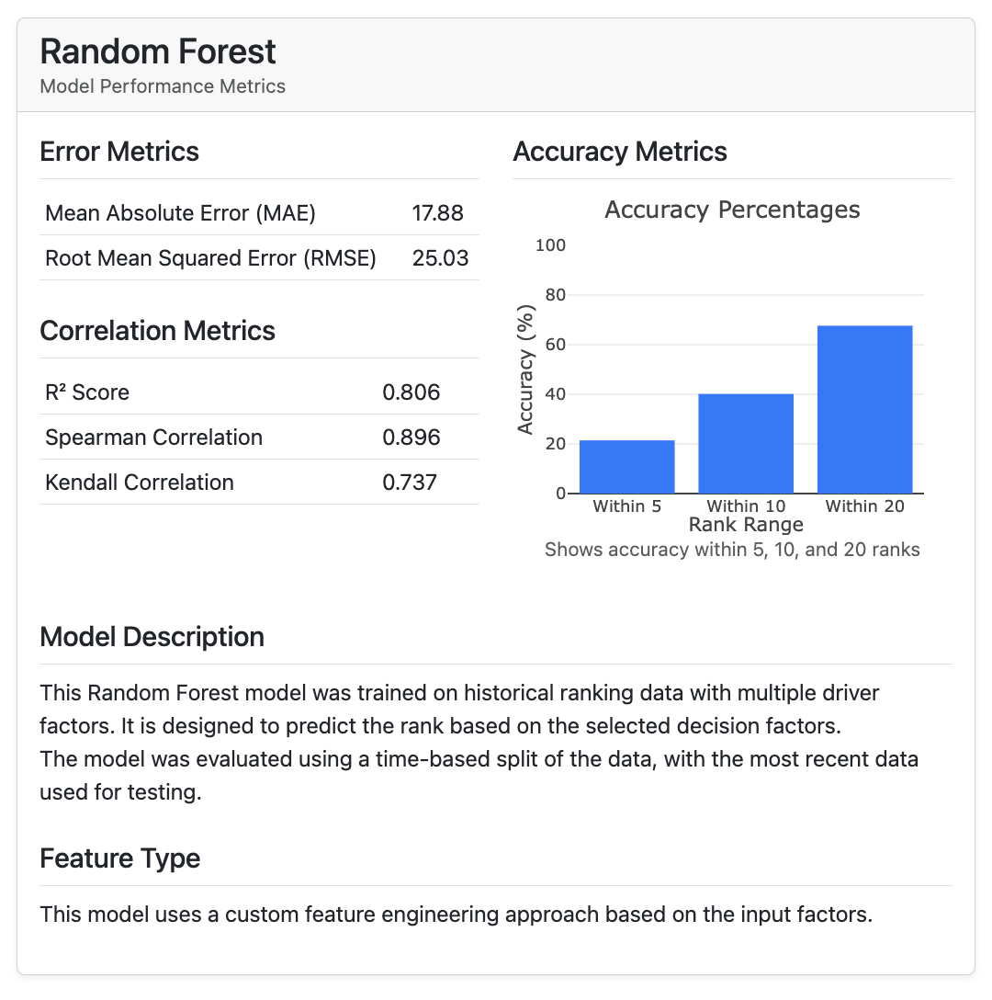

# RankLab Dashboard User Guide

This guide provides instructions on how to use the RankLab dashboard, whether you're accessing it locally or through the AWS deployment. A [screen recording](https://drive.google.com/file/d/1a8QUuOYbD_F4lETYktZ9tXeUtngpKZq9/view?usp=sharing) that demonstrates using the application can also be found on our Google Drive.

## Dashboard Access

After local installation following the instructions from `README.md`, open your web browser and go to `http://127.0.0.1:8050/` to access the dashboard. Alternatively, if using the AWS deployment, open your web browser and go to `http://3.90.69.124:8050/` to access the dashboard. It is important to note that this URL will no longer be active following the conclusion of the MSDS Capstone Fair.

## Dashboard Overview

The RankLab dashboard consists of several sections that help you analyze and predict rankings based on multiple criteria. Here's a breakdown of the main components:

-  **Model Selection Panel** - Choose prediction models
-  **Subject Selection Panel** - Select subjects to analyze
-  **Rank History Visualization** - View past rankings for a subject
-  **Subject History Visualization** - View historical factors for a subject
-  **Input Decision Factors** - Input values for new predictions
-  **Results** - View prediction results and model factor importances

## Using the Dashboard

### 1. Selecting a Prediction Model

RankLab offers multiple machine learning models for rank prediction:

1. Click on the model selection dropdown
2. Choose from:
   - LightGBM
   - XGBoost
   - Gradient Boosting
   - Random Forest

### 2. Selecting a Subject to Analyze

1. Use the Subject ID dropdown to select the subject you want to analyze
2. The dashboard will automatically load historical data for the selected subject

### 3. Viewing Subject History

Once you've selected a subject, the historical data visualization will display:

1. **Rank History Chart** - Shows how the subject's rank has changed over time
2. **Model Predictions** - Overlays predictions from the selected models
3. **Factor Values** - Displays the values of key factors at each point in time

Using Plotly allows the user to:
- Hover over data points to see detailed information
- Zoom in/out using the time slider
- Toggle different models on/off in the visualization

### 4. Making New Predictions

To generate new rank predictions:

1. Scroll to the "Input Decision Factors" section
2. Input values for each of the 17 decision-making factors:
   - Use the sliders or input boxes to set values
   - Driver1 represents the driver having the largest influence on Rank, and Driver17 represents the driver having the smallest influence on Rank.

3. Click the "Predict" button
4. View the predicted rank in the Prediction Result area

### 5. Understanding Prediction Results

The Influential Factors and Prediction Result panels provide:

1. The numeric rank prediction
2. The accuracy of the selected model
3. Which factors had the most impact on the prediction

For feature importance:
- Longer bars and darker colors indicate higher impact on the prediction

### 6. Saving Predictions

To save your predictions and display predictions within the Rank History graph:

1. Before generating a prediction, click the "Show Date and Time Input (Store in Database)" button
2. Enter the date and timestamp that you would like to use for forecasting
3. Click "Predict Rank"

Saved predictions will be stored in the database and can be accessed later upon selecting a subject from the "Select Subject ID" dropdown.

### 7. Comparing Multiple Models

To compare predictions across different models:

1. Select models using the "Select Prediction Model" dropdown
2. Enter the factor values as described above
3. Click "Predict Rank"
4. View the comparison chart showing predictions from each model

The comparison view helps you understand:
- Which models predict similar rankings
- The range of possible rankings

In addition, model performance can be compared by clicking the "Model Information" tab. In this tab, users can view the performance metrics of the selected model, which includes error metrics, correlation metrics, and accuracy metrics. This tab also includes a description of the model and features used during training. An example using Random Forest is shown below.

